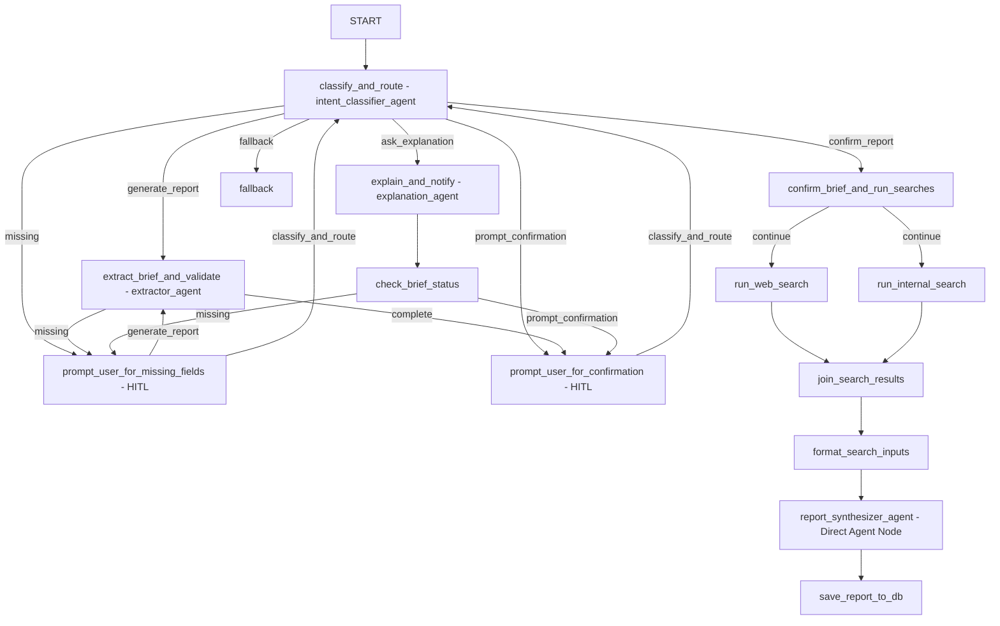

# company-health-analyst

## Use case
This is a dummy use case where an agent is used to help a user to generate a financial report on a company using both web search and internal knowledge (mocked).

### Example End-to-End Conversation (Integration Scenario)

This multi-turn scenario demonstrates intent classification, Human-in-the-Loop (HITL) parameter prompting, explanation Q&A during pauses, report generation, and parameter modification:

1. **Greeting & Explanation**
   - **User:** *"Hello, what is this tool for?"*
   - **Agent:** Greets the user and explains that it is a company health assistant where you can enter a company name, timeframe, and region to analyze.
2. **Initial Analysis Request & Missing Parameter Detection**
   - **User:** *"Analyze XYZ, it was founded in 2020 by John Doe"*
   - **Agent:** Captures the company name (`XYZ`) and founding date (`2020`), but pauses workflow execution (HITL) to request the missing region.
3. **Conversational Question During HITL Pause**
   - **User (HITL):** *"Remind me when was the company founded again?"*
   - **Agent:** Routes to the explanation subagent to reply *"2020"*, then automatically re-asks for the missing region.
4. **Historical Query During HITL Pause**
   - **User (HITL):** *"Give me the summary of past reports on the company"*
   - **Agent:** Routes to the explanation subagent to summarize historical reports, then automatically re-asks for the missing region.
5. **Providing Missing Parameter & Completing Brief**
   - **User (HITL):** *"Europe"*
   - **Agent:** Captures `Europe` as the region. With all mandatory parameters complete (`XYZ`, `2026` (Fallback to current year), `Europe`), it pauses (HITL) asking the user for confirmation to proceed.
6. **Confirming & Generating Report**
   - **User (HITL):** *"ok"*
   - **Agent:** Performs web and internal searches, cross-references findings, and generates the Markdown Company Health Report.
7. **Post-Report Comparison Q&A**
   - **User:** *"Compare this new report to past reports"*
   - **Agent:** Routes to the explanation agent to compare the newly generated report against historical archives.
8. **Modifying a Parameter**
   - **User:** *"Change the parameter to use Asia"*
   - **Agent:** Updates the target region in state to `Asia`, resets report completion status, and pauses (HITL) asking for confirmation.
9. **Modifying Another Parameter**
   - **User (HITL):** *"Also change the time span to 2025"*
   - **Agent:** Updates the timeframe in state to `2025` and pauses (HITL) asking for confirmation.
10. **Confirming Modified Parameters & Generating New Report**
    - **User (HITL):** *"all good"*
    - **Agent:** Reruns searches and synthesizes a fresh Company Health Report for `XYZ` (`Asia`, `2025`).

## Project Structure

```
company-health-analyst/
├── company_health_analyst/    # Core agent logic and FastAPI app
│   ├── agent.py               # Package agent loader
│   ├── subagents.py           # Declares sub-agents
│   ├── fast_api_app.py        # Production server entrypoint
│   ├── graph.py               # ADK 2.0 Graph Workflow topology
│   ├── nodes.py               # Node implementations & routing logic
│   ├── schemas.py             # Structured Pydantic data schemas
│   ├── prompts.py             # System instructions for sub-agents
│   ├── services.py            # Mock searches & date normalization
│   ├── tools.py               # Strategy assistant inspection tools
│   └── app_utils/             # Configuration & logging helpers
├── tests/                     # Test suite
│   ├── unit/                  # Fast offline unit tests
│   ├── integration/           # Live end-to-end integration & replay tests
│   └── eval/                  # Evaluation methodology & datasets
├── app.py                     # Local ASGI application entrypoint
├── reasoning_engine.py        # Reasoning Engine wrapper entrypoint
├── Dockerfile                 # Container packaging definition
└── pyproject.toml             # Project dependencies & packaging
```


## ADK 2.0 Specificities & Graph Design Choices

Our workflow is built using the ADK 2.0 `Workflow` graph API (in `company_health_analyst/graph.py`), combining deterministic Python routing nodes with specialized LLM subagents. Below are the core design decisions and ADK 2.0 patterns implemented in this repository:

### Workflow Topology Diagram



### 1. Node Wrappers vs. Direct Graph Nodes
In ADK 2.0 Workflows, you can embed an `LlmAgent` directly as a node in the graph, or wrap it inside a custom Python `@node` function. When should you use each?

- **Use a Direct Agent Node** when:
  - **Direct input/output pass-through**: The agent consumes the output of the preceding node directly and emits text/markdown that should be streamed straight to the user or passed to the next node.
  - **No custom logic needed**: You do not need to mutate state, perform deterministic validations, or branch graph execution based on the output.
  - *Example*: `report_synthesizer_agent` is placed directly in `company_health_analyst/graph.py` because it receives formatted search results from `format_search_inputs` and streams the final Markdown report directly to the user.

- **Use a Node Wrapper (`@node` function wrapping an agent)** when:
  - **Silencing subagent output**: You are using an LLM to generate structured JSON for internal decision-making (such as intent classification or parameter extraction) and want to **silence** the raw JSON output so it is not displayed in the user chat.
  - **Executing deterministic code**: You need to run Python logic before or after the LLM call—such as cleaning input text (`_extract_text_input`), parsing structured JSON into Pydantic models, updating session state (`ctx.state`), or applying domain rules (date normalization).
  - **Conditional routing & HITL**: You need to inspect the LLM's output to determine which graph edge to follow (`Event(route=...)`) or trigger Human-in-the-Loop interruptions (`RequestInput`).
  - *Example*: `intent_classifier_agent` and `extractor_agent` (defined in `company_health_analyst/subagents.py`) are wrapped inside `classify_and_route` and `extract_brief_and_validate` (in `company_health_analyst/nodes.py`).

### 2. Subagent Invocation: `run_async` vs. `ctx.run_node`
When invoking an LLM subagent from inside a Python node wrapper, ADK 2.0 provides two execution methods. When should you use `run_async` vs. `ctx.run_node`?

- **Use `subagent.run_async(inv_ctx)`** when:
  - **Silencing output for background inspection**: You want to run the subagent programmatically in the background, inspect its output, and decide what to do without letting the subagent stream its text to the end user.
  - **Iterative event filtering**: You want to manually iterate over events (`async for event in subagent.run_async(inv_ctx):`) to capture structured JSON (`event.output`) or yield only specific metadata (such as `usage_metadata`) while swallowing conversational tokens.
  - *Example*: In `classify_and_route` and `extract_brief_and_validate`, we use `run_async(inv_ctx)` to evaluate JSON structured outputs for internal routing decisions while silencing the raw JSON from the user chat.

- **Use `await ctx.run_node(subagent, ..., use_as_output=True)`** when:
  - **Delegating real-time conversational streaming**: You want the child agent's streaming tokens, tool calls, and responses to be emitted directly to the user as if the wrapper node itself produced them.
  - **Dynamic subagent scheduling**: Your Python node dynamically selects an agent to run and wants ADK's engine to manage its execution and output delegation (`use_as_output=True`).
  - *Example*: In `explain_and_notify` (in `company_health_analyst/nodes.py`), we call `await ctx.run_node(explanation_agent, node_input=query, use_as_output=True)` so that answers and strategy explanations are streamed directly to the user in real-time. Note that any node calling `ctx.run_node()` must be decorated with `@node(rerun_on_resume=True)` to support workflow resumability.

### 3. Session History & Turn Retention (`include_contents`)
We selectively configure whether subagents retain multi-turn conversation history using the `include_contents` parameter in `company_health_analyst/subagents.py`:
- **Stateless Single-Turn Processing (Default / `none`)**: For `intent_classifier_agent`, `extractor_agent`, and `report_synthesizer_agent`, we do not set `include_contents="default"`. This ensures each extraction or classification step evaluates the prompt cleanly without being confused by previous turns, report markdown, or historical tool outputs.
- **Multi-Turn Conversational Q&A (`include_contents="default"`)**: For `explanation_agent`, we explicitly set `include_contents="default"`. This enables the Q&A assistant to retain full session conversation history across turns, allowing the user to ask follow-up questions, compare past reports, or reference previous answers seamlessly during workflow pauses.

### 4. Human-in-the-Loop (HITL) & Resumability (`rerun_on_resume=True`)
- ADK 2.0 Workflows pause for user input using `RequestInput(interrupt_id=...)` in `prompt_user_for_missing_fields` and `prompt_user_for_confirmation` (in `company_health_analyst/nodes.py`).
- Both HITL nodes are decorated with `@node(rerun_on_resume=True)`. When execution resumes, ADK re-enters the node with the user's response in `ctx.resume_inputs[interrupt_id]`. The node increments its loop counter and routes execution forward.

## Requirements

Before you begin, ensure you have:
- **uv**: Python package manager - [Install](https://docs.astral.sh/uv/getting-started/installation/)
- **agents-cli**: Agents CLI - Install with `uv tool install google-agents-cli`
- **Google Cloud SDK**: For GCP services - [Install](https://cloud.google.com/sdk/docs/install)

## Quick Start

Install and clean up the local virtual environment:

```bash
agents-cli install --clean
```

Test the agent with a local playground web server:

```bash
agents-cli playground
```

## Commands

| Command | Description |
| ------- | ----------- |
| `uv sync` | Install project dependencies |
| `agents-cli playground` | Launch local development environment |
| `agents-cli lint` | Run code quality checks |
| `agents-cli eval` | Evaluate agent behavior (generate, grade, analyze, etc.) |
| `uv run python -m pytest tests/` | Run unit and integration tests |
| `agents-cli deploy` | Deploy agent to Agent Runtime |
| `agents-cli publish gemini-enterprise` | Register deployed agent to Gemini Enterprise |

## Development

Edit your agent logic in `graph.py` (node topology), `agent.py` (serving wrapper), and subagent prompts/tools in `prompts.py` and `tools.py`. Test with `agents-cli playground` or run tests with `pytest`.

## Testing

The project includes both fast offline unit tests and live end-to-end integration tests.

### How to Run Tests
- **Run all tests**:
  ```bash
  uv run pytest tests/
  ```
- **Run fast unit tests (offline)**:
  ```bash
  uv run pytest tests/unit/
  ```
- **Run live integration tests**:
  ```bash
  uv run pytest tests/integration/
  ```
- **Run the 10-turn HITL integration scenario**:
  ```bash
  uv run pytest -s tests/integration/test_agent.py -k test_multi_turn_hitl_scenario
  ```

### What is Mocked vs. Not Mocked in Integration Tests
- **LLM Calls (NOT Mocked)**: In the integration tests (`tests/integration/test_agent.py`), **LLM calls are not mocked**. They make live requests to `gemini-3.6-flash` via Google Cloud Vertex AI to verify real-world intent classification, extraction, and report synthesis.
- **Environment & Auth**: Integration tests automatically load configuration from your `.env` file (such as `GOOGLE_GENAI_USE_VERTEXAI=true` and `GOOGLE_CLOUD_PROJECT`) to connect to your GCP project.
- **Search & Data Services (Mocked)**: External web search and internal database lookups use deterministic in-memory services (`MockSearchService` and `MockInternalService`) so tests execute reliably without live web scraping or database dependencies.
- **Workflow Replay Tests (Mocked LLMs)**: Replay tests (`tests/integration/test_workflow_replay.py`) use patched LLM events to test graph state transitions and HITL resumability deterministically without external API calls.

## Deployment

```bash
gcloud config set project <your-project-id>
agents-cli deploy
```

* To add CI/CD and Terraform, run `agents-cli scaffold enhance`.
* To set up your production infrastructure, run `agents-cli infra cicd`.

## Observability

Built-in telemetry exports to Cloud Trace, BigQuery, and Cloud Logging.
