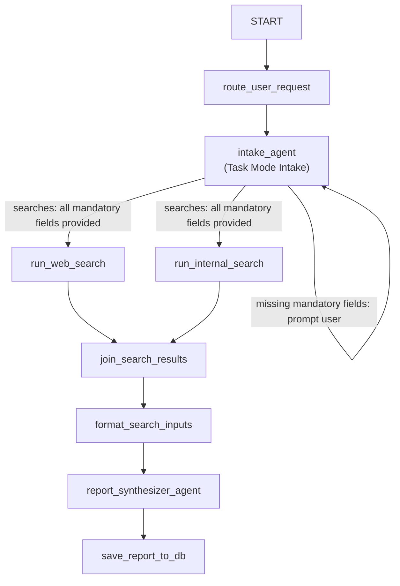

# company-health-analyst

## Use case
This application implements a dummy use case "enterprise financial health analyst agent" using the Google Agent Development Kit (ADK 2.0). The agent conducts conversational intake to elicit analysis parameters, executes parallel web and internal knowledge searches, synthesizes a comprehensive Markdown company health report, and supports post-report comparative strategic Q&A and parameter modifications.

### Example End-to-End Conversation (Integration Scenario)

This 10-turn multi-turn scenario demonstrates conversational intake via ADK Task Mode, parameter elicitation, historical report inspection, parallel search fan-out, report synthesis, post-report analytical Q&A, and parameter modification:

1. **Greeting & Capabilities Explanation**
   - **User:** *"Hello, what is this tool for?"*
   - **Agent:** Greets the user and explains that it is a company health assistant designed to analyze target companies across specified timeframes and geographic regions.
2. **Initial Analysis Request & Parameter Elicitation**
   - **User:** *"Analyze XYZ, it was founded in 2020 by John Doe"*
   - **Agent:** Captures the company name (`XYZ`) and founding context, identifies missing parameters (`region` and `time_span`), and prompts follow-up questions to collect them.
3. **Conversational Question During Intake**
   - **User:** *"Remind me when was the company founded again?"*
   - **Agent:** References active session context to answer *"2020"*, and prompts the user for the missing region parameter.
4. **Historical Report Lookup During Intake**
   - **User:** *"Give me the summary of past reports on the company"*
   - **Agent:** Calls [`search_previous_reports`](company_health_analyst/tools.py) to inspect archived reports, returns a summary, and resumes intake parameter collection.
5. **Providing Missing Parameter**
   - **User:** *"Europe"*
   - **Agent:** Updates the brief with region `Europe` and prompts for confirmation of the target timeframe.
6. **Confirming & Generating Report**
   - **User:** *"ok, use 2026"*
   - **Agent:** [`intake_agent`](company_health_analyst/subagents.py) invokes `finish_task` with complete parameters (`XYZ`, `2026`, `Europe`). The workflow advances to run parallel web and internal searches and synthesize the Markdown Company Health Report.
7. **Post-Report Comparison Q&A**
   - **User:** *"Compare this new report to past reports"*
   - **Agent:** [`route_user_request`](company_health_analyst/nodes.py) classifies the query as an analytical question and delegates to [`explanation_agent`](company_health_analyst/subagents.py) with session history and context inspection tools.
8. **Modifying a Parameter**
   - **User:** *"Change the parameter to use Asia"*
   - **Agent:** Router detects modification intent, transitions back to [`intake_agent`](company_health_analyst/subagents.py), updates region to `Asia`, and resets report state.
9. **Modifying Another Parameter**
   - **User:** *"Also change the time span to 2025"*
   - **Agent:** [`intake_agent`](company_health_analyst/subagents.py) updates timeframe in state to `2025`.
10. **Confirming Modified Parameters & Generating New Report**
    - **User:** *"all good"*
    - **Agent:** [`intake_agent`](company_health_analyst/subagents.py) calls `finish_task` with updated parameters (`XYZ`, `Asia`, `2025`), triggering fresh searches and generating an updated Company Health Report.

## Project Structure

```
company-health-analyst/
├── company_health_analyst/    # Core agent logic and FastAPI app
│   ├── agent.py               # Package agent entrypoint & App definition
│   ├── graph.py               # ADK 2.0 Workflow graph topology & node wiring
│   ├── nodes.py               # Ingress router & deterministic search nodes
│   ├── subagents.py           # Declares task-mode intake, synthesizer, & Q&A agents
│   ├── schemas.py             # Pydantic data schemas (CompanyBrief, Intent, etc.)
│   ├── prompts.py             # System instructions & PromptTemplate definitions
│   ├── services.py            # Mock web search & internal financial search services
│   ├── tools.py               # Inspection tools (fetch_report_context, search_previous_reports)
│   ├── fast_api_app.py        # Production server entrypoint with streaming SSE endpoints
│   └── app_utils/             # Configuration & logging helpers
├── tests/                     # Test suite
│   ├── unit/                  # Fast offline unit tests (test_agent.py)
│   ├── integration/           # Live Vertex AI & deterministic workflow replay tests
│   └── eval/                  # Evaluation methodology & datasets
├── app.py                     # Local ASGI application entrypoint
├── reasoning_engine.py        # Reasoning Engine wrapper entrypoint
├── Dockerfile                 # Container packaging definition
└── pyproject.toml             # Project dependencies, packaging, & tool configuration
```

## ADK 2.0 Specificities & Graph Design Choices

The workflow is built using the ADK 2.0 `Workflow` graph API in [`company_health_analyst/graph.py`](company_health_analyst/graph.py), combining a dynamic routing node with a task-mode intake agent, deterministic parallel data nodes, and specialized subagents.

### Workflow Topology Diagram



### 1. Autonomous Task-Mode Intake Subagent (`mode="task"`)

Instead of managing conversational elicitation and parameter verification through manual state-machine loops, the intake workflow is encapsulated within [`intake_agent`](company_health_analyst/subagents.py) using ADK Task Mode. The downstream components of the graph will not be run until the goal of this task is achieved:

- **Configuration**: [`intake_agent`](company_health_analyst/subagents.py) is declared with `mode="task"`, `output_schema=CompanyBrief`, and `output_key="company_brief"`.
- **Autonomous Multi-Turn Elicitation**: The agent conducts multi-turn conversation directly with the user. It answers greeting questions, provides service capabilities, and looks up historical context using [`fetch_report_context`](company_health_analyst/tools.py) and [`search_previous_reports`](company_health_analyst/tools.py).
- **Goal Completion via `finish_task`**: When all required fields (`company_name`, `time_span`, `region`) in [`CompanyBrief`](company_health_analyst/schemas.py) are collected and verified, [`intake_agent`](company_health_analyst/subagents.py) invokes the built-in `finish_task` tool. This produces the structured output that resolves the task and advances graph execution.

### 2. Dynamic Ingress Routing Gateway (`route_user_request`)

The [`route_user_request`](company_health_analyst/nodes.py) node serves as the single ingress routing gateway connected from `START`. This is necessary to allow the user flexibility to start with a new report or ask about past reports, and to ask about explanations or change a report once it is generated:

- **Pre-Report Lifecycle (`is_report_created = False`)**:
  - Delegates execution to [`intake_agent`](company_health_analyst/subagents.py) via `await ctx.run_node(intake_agent, node_input=query, use_as_output=True)`.
  - While conversational intake is in progress, `ctx.run_node` returns `None`, streaming tokens directly to the user and concluding the turn without advancing downstream edges.
  - When [`intake_agent`](company_health_analyst/subagents.py) calls `finish_task`, `ctx.run_node` returns the validated [`CompanyBrief`](company_health_analyst/schemas.py). The router saves the brief into `ctx.state["company_brief"]` and returns `Event(output=brief, route="searches")` to trigger the downstream pipeline.
- **Post-Report Lifecycle (`is_report_created = True`)**:
  - Classifies the user's intent using [`classify_intent_async`](company_health_analyst/nodes.py).
  - For parameter modifications or new analyses (`IntentCategory.GENERATE_REPORT`, `IntentCategory.MODIFY`), it resets `ctx.state["is_report_created"] = False` and routes to [`intake_agent`](company_health_analyst/subagents.py).
  - For informational or strategic deep-dives (`IntentCategory.ASK_EXPLANATION`), it executes [`explanation_agent`](company_health_analyst/subagents.py) with session history and context inspection tools.

### 3. FunctionNode Configuration: `FunctionNode(rerun_on_resume=True)` vs. `@node(rerun_on_resume=True)`

ADK 2.0 provides two ways to wrap Python functions with workflow orchestration options (such as `rerun_on_resume=True` Human In The Loop HITL):

- **Explicit `FunctionNode(func=..., rerun_on_resume=True)` (Used in this repository)**:
  - **Separation of Concerns**: Kept in [`company_health_analyst/graph.py`](company_health_analyst/graph.py) as topology definition, keeping [`route_user_request`](company_health_analyst/nodes.py) in [`company_health_analyst/nodes.py`](company_health_analyst/nodes.py) as a pure, undecorated async function.
  - **Unit Testing Ergonomics**: Pure async functions can be imported and invoked directly in unit tests (e.g. `await route_user_request("Analyze Nike", mock_ctx)`) without unwrapping decorator objects or accessing `._func`.
  - **Node Customization**: Allows configuring `name`, `retry_config`, `timeout`, and parameter bindings independently of the underlying function implementation.

- **Decorator `@node(rerun_on_resume=True)`**:
  - **Inline Definition**: Wraps the function at definition time in `nodes.py`, converting it into a `FunctionNode` at import time.
  - **Direct Edge Placement**: The decorated function object can be passed directly to `Workflow(edges=[...])` without separate instantiation.
  - **Testing Consideration**: Direct calls in unit tests need to invoke the underlying function via `my_node._func(...)` if not executing within a workflow harness.

- **Role of `rerun_on_resume=True`**:
  - When `rerun_on_resume=False` (default for standard function nodes), resuming a session bypasses the node and treats the incoming user reply as the node's completed output.
  - When `rerun_on_resume=True`, the ADK workflow engine re-executes the node function upon session resume, making it mandatory for nodes that dynamically schedule child subagents using `await ctx.run_node(...)`.

### 4. Direct Graph Nodes vs. Parallel Pipeline Fan-out

- **Direct Agent Nodes**: [`report_synthesizer_agent`](company_health_analyst/subagents.py) is wired directly into the graph topology between [`format_search_inputs`](company_health_analyst/nodes.py) and [`save_report_to_db`](company_health_analyst/nodes.py). It consumes formatted search results and streams the final Markdown report directly.
- **Deterministic Parallel Fan-out & Join**: [`run_web_search`](company_health_analyst/nodes.py) and [`run_internal_search`](company_health_analyst/nodes.py) execute concurrently, fan in to `JoinNode` in [`company_health_analyst/graph.py`](company_health_analyst/graph.py), and pass aggregated data to [`format_search_inputs`](company_health_analyst/nodes.py) for prompt construction.

### 5. Session History & Turn Retention (`include_contents`)

- **Multi-Turn Conversational Q&A (`include_contents="default"`)**: [`explanation_agent`](company_health_analyst/subagents.py) explicitly sets `include_contents="default"`. This enables the Q&A assistant to retain full session history, allowing users to ask follow-up questions, compare against past reports, and drill into specific findings seamlessly.
- **Stateless Node Processing**: [`report_synthesizer_agent`](company_health_analyst/subagents.py) operates statelessly on its node input, avoiding unnecessary context overhead.

### 6. Out-of-Band Intent Classification (`client.aio.models` vs. `ctx.run_node`)

In [`company_health_analyst/nodes.py`](company_health_analyst/nodes.py), the post-report router classifies user intent using direct async calls to [`client.aio.models.generate_content`](company_health_analyst/nodes.py) rather than executing an agent via `ctx.run_node` or `run_async`:

- **Session History Isolation (Preventing Context Contamination)**: When an `LlmAgent` is executed through `ctx.run_node` or `run_async`, ADK automatically records all emitted events, tool calls, and model outputs into `ctx.session.events`. Because [`explanation_agent`](company_health_analyst/subagents.py) uses `include_contents="default"` to retain multi-turn conversational history, logging intermediate routing JSON (`{"intent": "...", "explanation": "..."}`) into session events would pollute the context for downstream reasoning. A direct SDK call performs stateless, out-of-band classification without mutating session event history.
- **Preventing Output Streaming Leaks**: In ADK 2.0, `ctx.run_node(..., use_as_output=True)` delegates streaming events straight to the client. Executing intent classification directly against the Google GenAI SDK guarantees that intermediate JSON routing decisions remain purely internal to [`route_user_request`](company_health_analyst/nodes.py) and never leak to the user stream.
- **Granular Retry Resilience**: Direct client calls are decorated with `tenacity.retry` with exponential backoff, handling transient quota or network errors at the function boundary without triggering graph node re-entry.
- **Reduced Execution Overhead**: A single-shot structured JSON classification with `response_schema=IntentClassification` avoids the overhead of instantiating subagent invocation contexts, lifecycle hooks, and tool registries.

### 7. Subagent Invocation Patterns: `ctx.run_node` vs. `agent.run_async`

When invoking subagents from custom Python workflow nodes, ADK 2.0 provides two execution paradigms depending on output delegation and lifecycle management:

- **Use `await ctx.run_node(agent, node_input=..., use_as_output=True)`** when:
  - **Conversational Streaming Delegation**: You want the child agent's real-time streaming tokens, thoughts, tool invocations, and responses streamed straight to the user as the node's official output.
  - **Task Mode Lifecycle Management**: The ADK engine manages multi-turn task progression and returns the final structured payload (such as [`CompanyBrief`](company_health_analyst/schemas.py)) upon task completion via `finish_task`.
  - *Example*: Used in [`route_user_request`](company_health_analyst/nodes.py) to execute [`intake_agent`](company_health_analyst/subagents.py) and [`explanation_agent`](company_health_analyst/subagents.py).

- **Use `agent.run_async(inv_ctx)`** when:
  - **Programmatic Event Interception & Output Silencing**: You want to manually iterate through the raw event stream (`async for event in agent.run_async(inv_ctx):`) to capture specific metadata, inspect intermediate tool calls, or parse structured payloads without streaming them to the user.
  - **Manual Invocation Control**: You need fine-grained control over execution with a custom `InvocationContext` outside the standard engine-delegated streaming lifecycle.

## Requirements

Ensure you have the following prerequisites installed:
- **uv**: Python package and environment manager - [Install](https://docs.astral.sh/uv/getting-started/installation/)
- **agents-cli**: Google Agents CLI - Install with `uv tool install google-agents-cli`
- **Google Cloud SDK**: For GCP authentication and Vertex AI access - [Install](https://cloud.google.com/sdk/docs/install)

## Quick Start

Install project dependencies and clean the local environment:
```bash
uv run agents-cli install --clean
```

Upgrade agent-cli
````bash
uv run agents-cli upgrade
````

Launch the local development playground web server:
```bash
uv run agents-cli playground --port 8081 --host 0.0.0.0
```

## Commands

| Command | Description |
| ------- | ----------- |
| `uv sync` | Synchronize project dependencies |
| `agents-cli playground` | Launch local development playground |
| `agents-cli lint` | Run code quality checks (ruff and mypy) |
| `agents-cli eval` | Evaluate agent behavior against evaluation datasets |
| `uv run pytest tests/` | Run unit and integration tests |
| `agents-cli deploy` | Deploy agent to Agent Runtime |
| `agents-cli publish gemini-enterprise` | Register deployed agent to Gemini Enterprise |

## Development

Install the pre-commit hook to make sure linting checks pass.
```
pip install pre-commit
pre-commit install
```

Edit agent logic in [`company_health_analyst/graph.py`](company_health_analyst/graph.py) (workflow topology), [`company_health_analyst/nodes.py`](company_health_analyst/nodes.py) (routing and data nodes), [`company_health_analyst/subagents.py`](company_health_analyst/subagents.py) (subagent declarations), [`company_health_analyst/prompts.py`](company_health_analyst/prompts.py) (system instructions), and [`company_health_analyst/tools.py`](company_health_analyst/tools.py) (inspection tools). Test with `agents-cli playground` or run tests with `pytest`.

## Testing

The project includes offline unit tests, live end-to-end integration tests, and deterministic workflow replay tests.

### How to Run Tests

- **Run all tests**:
  ```bash
  uv run pytest tests/
  ```
- **Run offline unit tests**:
  ```bash
  uv run pytest tests/unit/
  ```
- **Run live integration tests**:
  ```bash
  uv run pytest tests/integration/
  ```
- **Run the 10-turn Task Mode integration scenario**:
  ```bash
  uv run pytest -s tests/integration/test_agent.py -k test_multi_turn_task_mode_scenario
  ```
- **Run workflow replay tests**:
  ```bash
  uv run pytest tests/integration/test_workflow_replay.py
  ```

### Test Architecture & Mocking Strategy

- **Live Integration Tests ([`tests/integration/test_agent.py`](tests/integration/test_agent.py))**: LLM calls are not mocked. They make live requests to Gemini on Vertex AI to verify real-world task-mode intake elicitation, intent classification, and report generation. External search services ([`MockSearchService`](company_health_analyst/services.py), [`MockInternalService`](company_health_analyst/services.py)) are deterministic in-memory services.
- **Workflow Replay Tests ([`tests/integration/test_workflow_replay.py`](tests/integration/test_workflow_replay.py))**: Replay tests use patched LLM events to verify graph execution, Task Mode multi-turn dialog, and `finish_task` state transitions deterministically without external API calls.
- **Unit Tests ([`tests/unit/test_agent.py`](tests/unit/test_agent.py))**: Test individual nodes ([`route_user_request`](company_health_analyst/nodes.py), [`run_web_search`](company_health_analyst/nodes.py), [`run_internal_search`](company_health_analyst/nodes.py), [`format_search_inputs`](company_health_analyst/nodes.py), [`save_report_to_db`](company_health_analyst/nodes.py)) and schema validations in isolation.

## Deployment

Deploy the agent to Google Cloud Vertex AI Agent Runtime:

```bash
gcloud config set project <your-project-id>
agents-cli deploy
```

- To add CI/CD pipelines and Terraform infrastructure, run `agents-cli scaffold enhance`.
- To set up production infrastructure, run `agents-cli infra cicd`.

## Observability

Built-in telemetry exports trace and execution metadata to Cloud Trace, BigQuery, and Cloud Logging.
