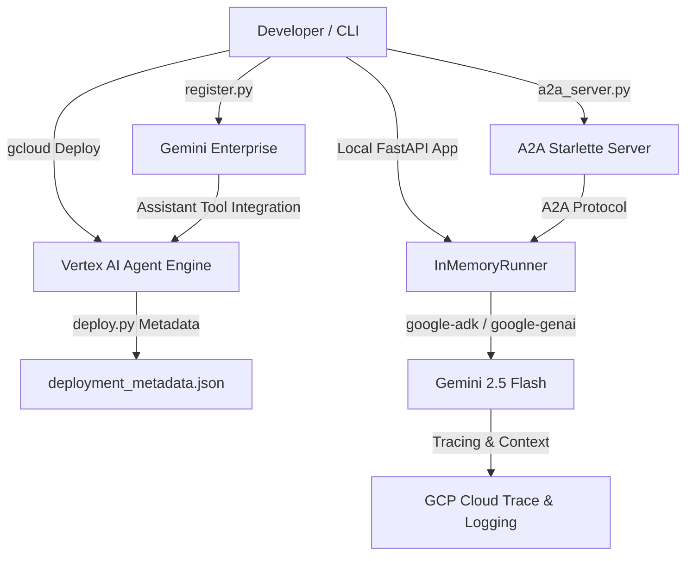

# Google Cloud Generative AI Agent Starter Kit (Developers Guide)

This guide documents the customized architecture, tools, and developer workflows implemented in this starter kit for building standalone Generative AI Agents on Google Cloud.

---

## 1. Architectural Overview

The template supports local debugging, async query executions, batch evaluations, and deployment/registration pipelines.



---

## 2. Gemini Enterprise Agent Platform Product Mapping

This template integrates directly with the **Gemini Enterprise Agent Platform** and its core governance and scaling products:

| Platform Pillar | Gemini Enterprise Product | How it is Integrated in this Codebase |
| :--- | :--- | :--- |
| **Build** | **Agent Development Kit (ADK)** | Instantiated via `google-adk` in [agent.py](__template_agent_py__/agent.py) to manage agent state, planning loops, and LLM orchestration. |
| | **Model Context Protocol (MCP)** | Scaffolded via `FastMCP` templates in [services/__template_mcp_py__](../services/__template_mcp_py__) to easily expose databases/API tools. |
| | **Remote Skills** | Managed via `RemoteSkillsManager` in [skills.py](../shared/py/components/skills.py) to sync remote prompt guidelines and register native `SkillToolset` modules. |
| | **A2A / A2UI** | Exposed via [a2a_server.py](__template_agent_py__/a2a_server.py) to map ADK agent runners to standard A2A HTTP protocols. |
| **Scale** | **Agent Runtime** | Running on **Vertex AI Agent Engine** (Reasoning Engine) deployed directly via the CLI task: `mise run agents-cli deploy`. |
| | **Agent Sandbox** | Provided locally via standard FastAPI runners in [app.py](__template_agent_py__/app.py) for dry-run testing before cloud deployment. |
| **Govern** | **Agent Identity** | Governed using GCP Service Accounts mapped at runtime and validated via [env_guard.py](../shared/py/components/env_guard.py). |
| | **Agent Registry** | Registered natively into the centralized **Agent Registry** in Gemini Enterprise via the CLI task: `mise run agents-cli publish gemini-enterprise`. |
| | **Agent Gateway / Model Armor** | Prompts are routed and sanitised via **Agent Gateway** with integrated **Model Armor** policies for jailbreak prevention and safety compliance. |
| **Optimize** | **Agent Observability** | Configured to stream GCP-structured trace-correlated logs and spans via [logging.py](../shared/py/components/logging.py) to **Vertex AI Agent Observability** / Cloud Logging. |
| | **Agent Evaluation** | Synthesized and graded natively using the evaluation suite commands: `mise run agents-cli eval generate` / `grade`. |

---

## 3. Core Modules & How They Work

### A. Standalone ADK Agent (`agent.py`)
Exposes class compatibility for both Vertex AI Reasoning Engine (Reasoning Engine spec requiring standard `set_up()` and `query()` hooks) and the Google Agent Development Kit (ADK):
*   Wraps the core agent logic with `google.adk.agents.Agent`.
*   Uses `google.adk.models.Gemini` for AI models.
*   Resolves execution turns locally using `google.adk.runners.InMemoryRunner`.
*   Automatically injects required environment variables (`GOOGLE_GENAI_USE_VERTEXAI = "1"`, `GOOGLE_CLOUD_PROJECT`, `GOOGLE_CLOUD_LOCATION`) upon load to route models securely through Vertex AI using Application Default Credentials (ADC).

### B. Structured Observability Logging (`logging.py`)
Located under `shared/py/components/logging.py`, this utility enforces structured logging best practices:
*   Generates JSON logs matching Google Cloud Logging format severity keys (`severity`, `message`, `timestamp`).
*   Extracts Python stack trace details on error and embeds them cleanly as a string block within the `exception` attribute.
*   Allows developers to pass extra diagnostic contexts (using the `extra={...}` payload wrapper) which is automatically indexed as queryable fields in the GCP Logs Explorer console.
*   Correlates trace Context Headers (OpenTelemetry trace-ids) when hosted in active tracing environments.

Example usage:
```python
from shared.py.components.logging import get_logger

logger = get_logger("agent")
logger.info("Starting processing task", extra={"item_id": 123})
```

### C. Remote Skills Manager (`skills.py`)
Exposes `RemoteSkillsManager` in `shared/py/components/skills.py` to utilize skills and tools from upstream repositories (like `google/skills` or `google/agents-cli`) without copying files manually:
*   **Git Sync**: Shallow clones (`--depth=1`) repositories to a local cache directory (`~/.skills_cache/`) and runs git pulls to fetch updates.
*   **Prompt Loader**: Loads `SKILL.md` markdown prompts from the cache dynamically.

Example usage:
```python
from shared.py.components.skills import RemoteSkillsManager

manager = RemoteSkillsManager()
skills_repo = "https://github.com/google/skills.git"

# Fetch instruction prompt
skill_prompt = manager.get_skill_prompt(skills_repo, "cloud/alloydb-basics")
```

### D. Native ADK Skill Integration
In ADK v2+, you can register your synced developer skills natively inside the agent's tools using `google.adk.tools.skill_toolset.SkillToolset`. This automatically registers `list_skills`, `load_skill`, `load_skill_resource`, and `run_skill_script` tools for the model, enabling dynamic loading and execution.

Example integration:
```python
from shared.py.components.skills import RemoteSkillsManager
from google.adk.skills import load_skill_from_dir
from google.adk.tools.skill_toolset import SkillToolset

# 1. Sync the remote repository using RemoteSkillsManager
skills_manager = RemoteSkillsManager()
repo_dir = skills_manager.sync_repo("https://github.com/google/skills.git")

# 2. Load the skill directory using ADK
skill_dir = repo_dir / "skills" / "alloydb-basics"
loaded_skill = load_skill_from_dir(skill_dir)

# 3. Equip the agent with the native SkillToolset
# ⚠️ SECURITY WARNING: The loaded skill may register tools and execute arbitrary bash or Python scripts.
# Ensure you trust the repository. For production, always pin to an immutable commit hash or tag.
agent_tools.append(SkillToolset(skills=[loaded_skill]))
```

> [!WARNING]
> **Dynamic Code Execution Warning**: Equipping the agent with `SkillToolset` allows the LLM to dynamically run scripts included in the skill's `scripts/` directory via the `run_skill_script` tool. Only load skills from Git repositories you fully trust. In production environments, always pin the target repository to an immutable git commit hash or tag to prevent code injection.


### E. Agent-to-Agent (A2A) Server (`a2a_server.py`)
Implements an HTTP server wrapping the ADK agent inside a Starlette application:
*   Exposes endpoints `/a2a/app/.well-known/agent-card.json` and `/a2a/app/chat` conforming to the Google Agent-to-Agent RPC protocol.
*   Used when calling the agent directly via A2A integrations (e.g. from Gemini Enterprise).
*   *Note: This server requires the private `a2a` Python library to be resolved and installed from the internal Google registry.*

### F. Secure Secret Access (`secrets.py`)
Accesses secret values dynamically at runtime from **Google Cloud Secret Manager** using Application Default Credentials (ADC):
*   Resolves the secret version (default: `latest`) from GCP.
*   Keeps passwords, API keys, and connection strings out of code commits.

### G. Enterprise Grounding (`grounding.py`)
Provides unified grounding tools for agent responses:
*   **Vertex AI Search**: Registers datastore retrieval queries directly in the LLM config as tools.
*   **Postgres pgvector similarity**: Runs Cosine Similarity vector queries against database tables (Cloud SQL).

---

## 4. FastMCP Service Scaffolding

Under `services/__template_mcp_py__`, we provide a template for Model Context Protocol (MCP) servers:
*   Uses `FastMCP` from the official Python `mcp` SDK to register agent tools.
*   Runs over Server-Sent Events (SSE) HTTP transport out-of-the-box, making it fully compatible with Cloud Run hosting.
*   To create a new server, copy `/services/__template_mcp_py__` to `/services/<name>`, rename `disabled_cloudrun.dockerfile` to `cloudrun.dockerfile`, and add its registration script to the root `mise.toml`.

---

## 5. Local Deployment & Registration Flow

1.  **FastAPI Local Queries (`app.py`)**:
    Provides a simple FastAPI runner to query the ADK agent locally:
    ```bash
    curl -X POST http://localhost:8000/query \
         -H "Content-Type: application/json" \
         -d '{"prompt": "Explain Cloud Run in one sentence."}'
    ```
2.  **Single-loop Evaluation (`eval.py`)**:
    Runs heuristic testing datasets sequentially inside a single async event loop, preventing event loop closures when invoking model endpoints. It dynamically loads test cases from [eval_dataset.json](eval_dataset.json) if present, and outputs results to `eval_report.json`.
3.  **Vertex AI Agent Engine Deployer (`deploy.py`)**:
    Packs dependencies (including `/shared`) as wheels, uploads the agent to Vertex AI, and outputs resource details to `deployment_metadata.json` automatically.
4.  **Gemini Enterprise Register (`register.py`)**:
    An idempotent CLI that reads `deployment_metadata.json` and registers/updates the Reasoning Engine agent as a tool inside a Gemini Enterprise assistant using Google Discovery Engine APIs.

---

## 6. Native Workspace Integration with `agents-cli`

Developers and AI coding assistants (like Antigravity) can run `agents-cli` commands natively from anywhere in the project root using `mise run agents-cli`:

*   **Scaffold a new agent**:
    ```bash
    mise run scaffold-agent <name>
    ```
    This uses the local template under `agents/__template_agent_py__` to scaffold a new agent inside `agents/`, normalizes names/placeholders automatically, and registers build/test/dev/deploy tasks inside your root `mise.toml`.
*   **Generate and run evaluations**:
    ```bash
    mise run agents-cli eval generate
    mise run agents-cli eval grade
    ```
*   **Deploy to Agent Runtime**:
    ```bash
    mise run agents-cli deploy --no-confirm-project
    # Or run interactively: mise run agents-cli deploy -i
    ```
*   **Publish to Agent Registry**:
    ```bash
    mise run agents-cli publish gemini-enterprise
    ```
*   **Platform Native Enhancements (OOTB)**:
    Since the scaffolded agents conform fully to standard ADK structures, you can run `agents-cli scaffold enhance` to add production infrastructure layers (like Cloud Run or databases) natively:
    ```bash
    cd agents/<agent-name>
    uv run agents-cli scaffold enhance --deployment-target cloud_run
    uv run agents-cli scaffold enhance --datastore agent_platform_search
    ```

Additionally, developers can install `google/agents-cli` skills natively into their active coding assistant configurations by running:
```bash
npx skills add google/agents-cli
```
This enables the assistant to automatically run scaffolding, evaluations, and platform publishing tasks.

---

## 7. CI/CD GitHub Actions Workflow

A production-grade CI/CD workflow is located in [.github/workflows/deploy.yaml](../.github/workflows/deploy.yaml):
*   **Authentication**: Authenticates securely to Google Cloud using **Workload Identity Federation (OIDC)** (no service account JSON keys stored in secrets).
*   **Testing**: Runs project-wide formatting, ruff checks, and linting first.
*   **Deployments**:
    *   Iterates through all custom folder packages in `/agents/` and triggers their `deploy.py` scripts to publish to Vertex AI.
    *   Iterates through all custom folder packages in `/services/` containing a `cloudrun.dockerfile` and deploys them to Cloud Run.

---

## 8. Choosing Your Architecture: Monorepo vs. Standalone

For detailed architectural guidelines, pros/cons, and "when to use" decision paths comparing Monorepo (Option A) and Standalone (Option B) formats, please refer to [Choosing Your Architecture](../../README.md#7-choosing-your-architecture-monorepo-vs-standalone) inside the root `README.md`.
